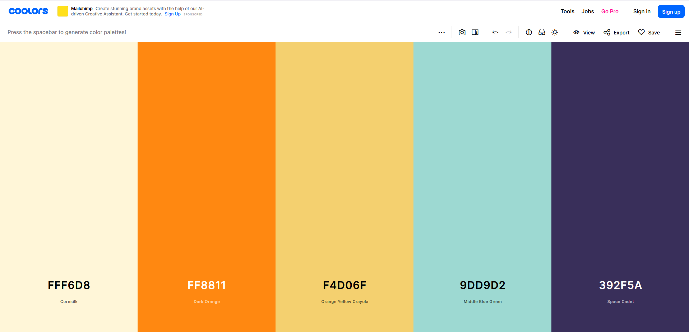
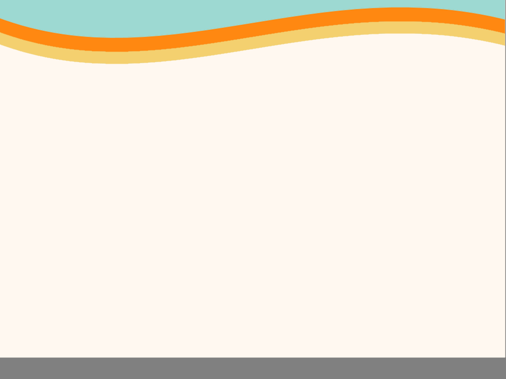
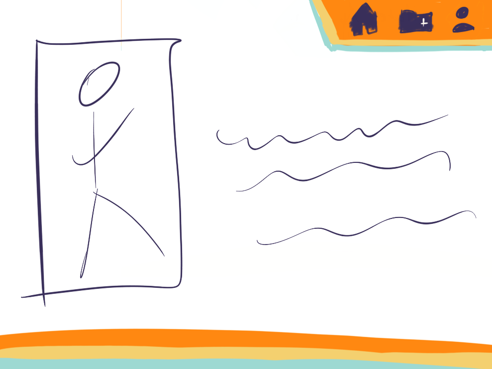
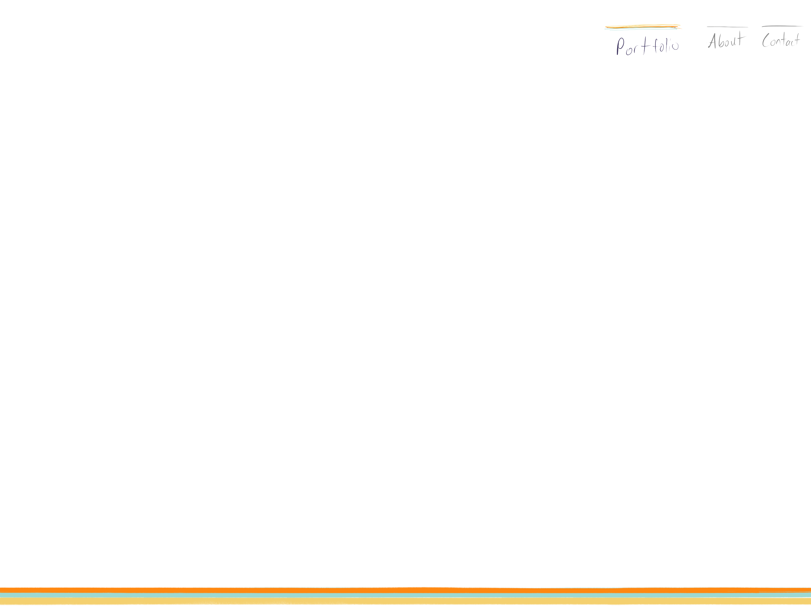
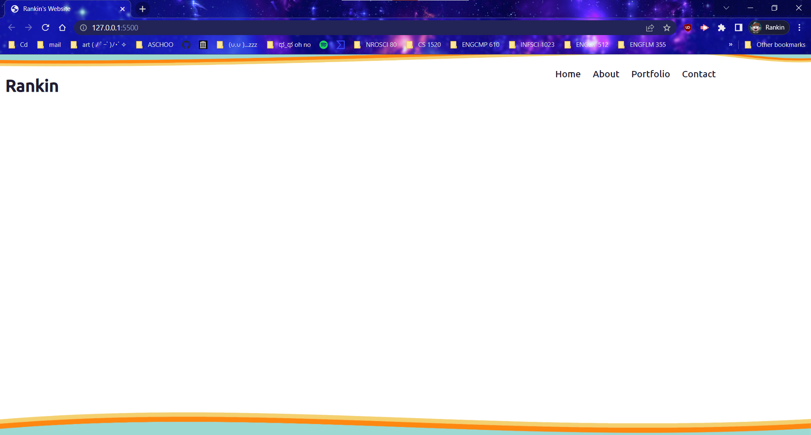
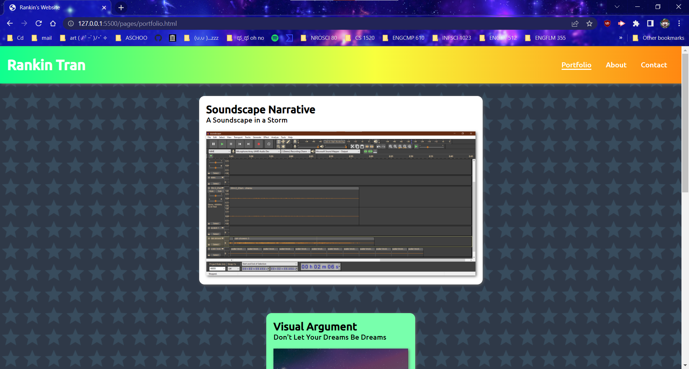
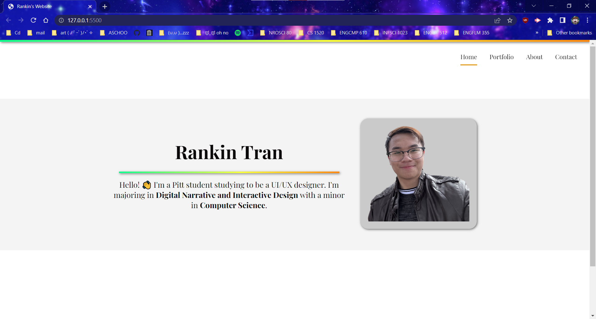
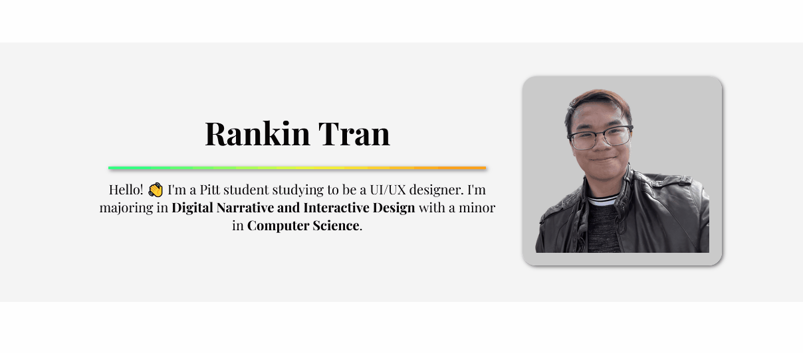

# Personal Portfolio Website

I'm planning for this website to be a more personalized portfolio wesbite. It will be a place for me to showcase work that I've done, while also serving as a chance to explore web styling and working with HTML CSS. This website will get updated designs in the future, beyond the class, to possibly to look more professional or technically skilled with animations. In any case, my future website would reference this legacy version as a display of how my skills and styling improve over time. Until I get to that point, I will be experimenting with things like JS and animations on my site.

<a href='https://rankint.github.io/'>Take a look!</a>

--------------

## Redesigns of Redesigns... and more Redesigns

### Initial Night Colors

I began with a super abstract idea of how I wanted my website to look. In fact, the idea was so abstract that it would be more accurate to say that I was thinking of how I wanted the website to <em>feel</em>. I liked the idea of a main 'night mode' with the moon being incorporated into the main look of the website, and the possibility of switching to a 'day mode' with the sun coming up to illuminate the page. The dark color palette would also be referencing the infamous black/blue (or white/gold) dress as a form of switching from day/night modes.

### A New Day with New Colors

After a couple of days, I was introduced to <a href="https://coolors.co/fff6d8-ff8811-f4d06f-9dd9d2-392f5a">coolors.co</a> which generates color palettes. I shuffled dozens of palettes until I landed on this one that really caight my attention. I felt that it fit with a light mode theme, so at this point I decided to use a light 'day mode' as the main theme instead of a dark one. 

### Its Kind of Curvy

When I first saw the color palette, I got the idea to have some kind of swirly curve accent on my page. I wasn't sure of where I wanted the accent, I just knew that I wanted something that non-sharp to frame my website. In the past, I heard that soft edges feel more welcoming and friendly. (Kiki vs Boba shapes)

### Sketching Layouts 

Once I had some ideas of what I wanted to include in my website, it was time to really think about the actual layout and how the website would look so I could get an idea of what elements need to be coded in HTML. The first layout has an icon nav bar with the curve accent at the bottom. The main content would fill the middle of the page with a larger image on the opposite side of the nav bar to balance out the page.

Despite trying to balance out the view with an image, it still didn't feel right. I toned everything down to a more minimal look so I could have more control over the balance of the page, using the content that I would add later.

-----------------------

## Implementing the Ideas

### HTML CSS: Headaches and Constant Stress

To place the accents on the page, I used <a href="https://www.getpaint.net/">Paint.NET</a> to design the PNG images and then tried to add them as  &lt;img&gt; elements and as background images to &lt;div&gt; elements. For some reason, the page layout would never workout and I didn't know how to get the accent to look good across different pages (and long pages since the accent is at the bottom). It was so frustrating that I completely ditched the curve accent.

### Getting Loosey Goosey

I was so annoyed by the issues I had in the previous version that I restarted my entire design. In this version, I was just cold coding my page, letting any idea that popped up get implemented directly onto the page. There was no planning that went into the design. This gave me a chance have fun again and be free to explore styling possibilities. 

### A Clean Start

I really liked the loosey goosey version, but it did not fit my intended theme of being a professional website. I reset everything but kept the gradient color accent. I reigned it back in with a minimalist look so the page would be cleaner and more concise. From this point, I had the style down to something I really loved, so I shifted my focus to learning how to add animations to really take advantage of it being a digital presentation of myself.

------------

## Reflection
asdasdasd